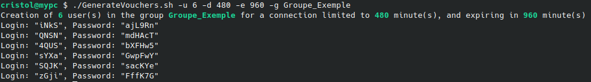
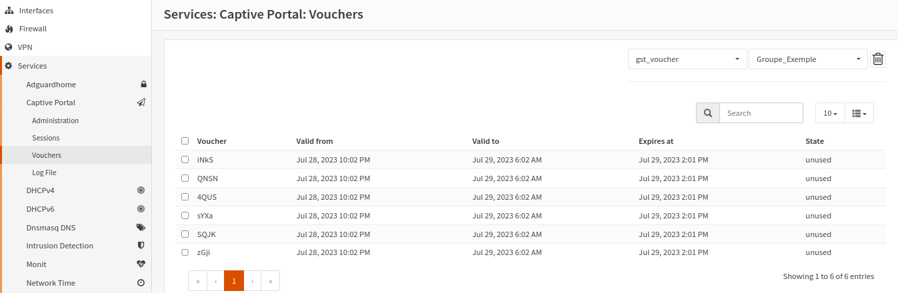

# Captive Portal User Generator <!-- omit in toc -->

- [GenerateVouchers.sh](#generatevoucherssh)
  - [Conf](#conf)
  - [Usage](#usage)
  - [Example](#example)


## GenerateVouchers.sh

This script allows you to create users specifically for the captive portal.
### Conf

A conf file **config.cfg** must be initialized at the same directory of this script
You can refer to the file **config_example.cfg**

### Usage

```bash
$ ./GenerateVouchers.sh
Usage : ./GenerateVouchers.sh [-u,-d,-e,-g]

-u --> Number of users to create (Default 1)
-d --> Active time in minutes (Default 240)
-e --> Validity time in minutes (Default 1440), you can set 0 to disable it
-g --> Name of the group (Default FromAPI)

```
> Default values ​​can be changed in the **config.cfg** file
### Example

```bash
$ ./GenerateVouchers.sh -u 6 -d 480 -e 960 -g Groupe_Exemple
Creation of 6 user(s) in the group Groupe_Exemple for a connection limited to 480 minute(s), and expiring in 960 minute(s)
Login: "iNkS", Password: "ajL9Rn"
Login: "QNSN", Password: "mdHAcT"
Login: "4QUS", Password: "bXFHw5"
Login: "sYXa", Password: "GwpFwY"
Login: "SQJK", Password: "sacKYe"
Login: "zGji", Password: "FffK7G"
``````


